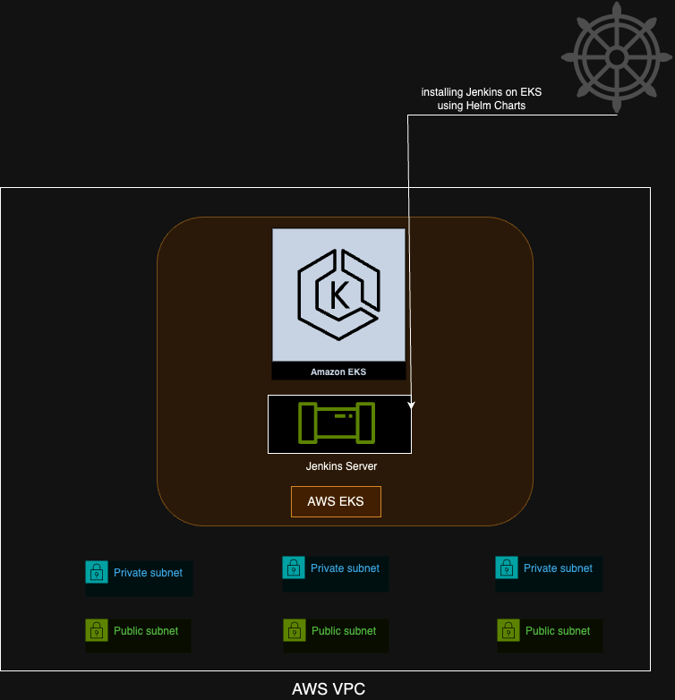
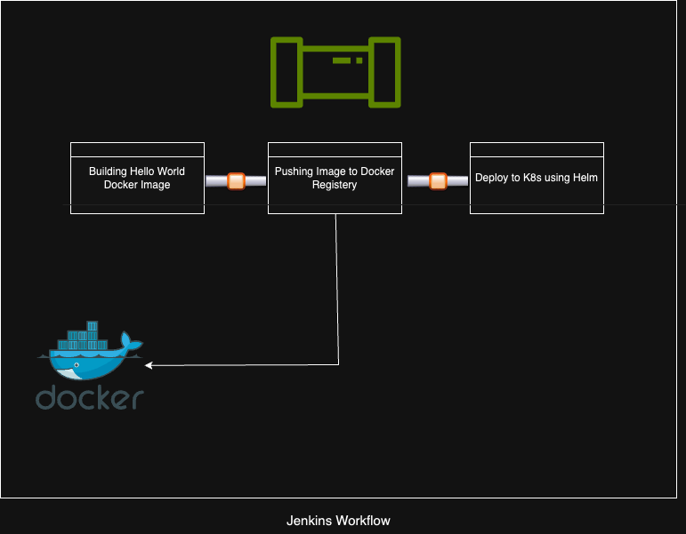

# DevOps Project

Short Description of the project :
* Create a terraform to launch EKS cluster, use modules. Code should be generic.
* EKS cluster should be private
* Cluster should be in a separate new VPC that contain three private and three public subnet
* Deploy jenkins server on EKS.
* Create a jenkins pipeline for hello world application using a helm chart.
* Helm chart should be in generic format
* Pipeline should be automatically triggered if any change in application.

## WorkFlow

Main Workflow :

Jenkins Workflow :

## Tech Stack

**Cloud :** AWS, EKS, VPC

**Infra Management :** Terraform

**CI/CD Pipeline :** Jenkins

**Other :** Helm Charts

## License

[MIT](https://choosealicense.com/licenses/mit/)

